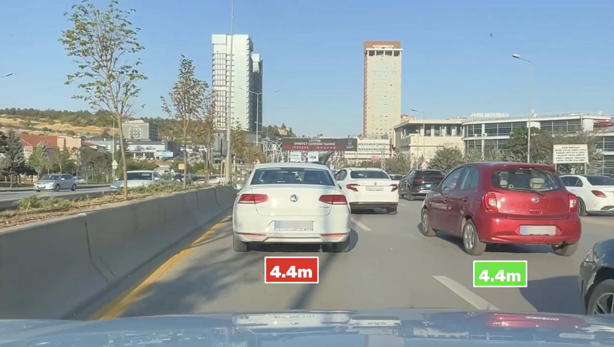

# Vehicle Distance Measurement

C++ translation of [kemalkilicaslan/Vehicle-Distance-Measurement-System](https://github.com/kemalkilicaslan/Vehicle-Distance-Measurement-System).

Object detection is performed with **OpenCV DNN** on **ONNX** models exported from Ultralytics YOLOv12.



---

## Features

- Real-time multi-vehicle detection (car, motorcycle, bus, truck)
- Monocular distance estimation via perspective projection & with displacement correction
- Three trapezoidal ROI lanes: **LEFT**, **MAIN**, **RIGHT**
- Adaptive warning thresholds per lane
- Automatic license-plate detection + Gaussian blur (privacy)
- Colour-coded distance labels (red = warning, green = safe)
- “VEHICLE TOO CLOSE!” banner
- Annotated MP4

---

## Requirements (macOS)

```bash
# Homebrew
brew install cmake opencv

# recommended for better inference speed
brew install onnxruntime
```

OpenCV ≥ 4.5 with the `dnn` module is required.

---

## Export models

```bash
pip install ultralytics
yolo export model=yolo12x.pt format=onnx imgsz=640

# Place the resulting .onnx files into the models/ folder
mkdir -p models
mv yolo12x.onnx models/
mv vehicle-plate.onnx models/
```

---

## Build

```bash
mkdir build && cd build
cmake -DCMAKE_BUILD_TYPE=Release ..
make -j$(sysctl -n hw.ncpu)
```

---

## Usage

```bash
./build/vehicle_distance \
  --video assets/sample.mp4 \
  --vehicle-model models/yolo12x.onnx \
  --plate-model models/rfdetr-custom.onnx \
  --output assets/output.mp4
```

### Cmd opts

| Flag | Default | Description |
|------|---------|-------------|
| `--video` / `-v` | `dashcam_video.mov` | Input video |
| `--vehicle-model` | `models/yolo12x.onnx` | Vehicle detector ONNX |
| `--plate-model` | `models/vehicle-plate.onnx` | Plate detector ONNX (optional) |
| `--output` / `-o` | `Vehicle-Distance-Measurement.mp4` | Output video |
| `--no-window` | – | Disable live preview |
| `--draw-roi` | – | Overlay the three ROI polygons |
| `--help` / `-h` | – | Show help |

**q** to quit early

---

## Config

All tunable constants live in `include/config.hpp`:

- Focal length, optical centres, ROI polygons
- Vehicle real-world heights
- Warning / display distance thresholds
- Confidence thresholds

Expected dashcam resolution `~2042×1148` or:

1. Resize the input video to that resolution, **or**
2. Scale the optical centres and ROI points (this code already scales the ROIs)

---

## Mathematical notes

**Distance**

\[
d = \frac{h_{\text{real}} \cdot f}{h_{\text{image}}} \cdot (1 + \alpha \cdot \delta)
\]

where \(\alpha = 0.0001\) and \(\delta\) is the Euclidean distance from the vehicle centre to the zone’s optical centre.

**Vehicle heights**

| Class ID | Type        | Height |
|----------|-------------|--------|
| 2        | Car         | 1.55 m |
| 3        | Motorcycle  | 1.20 m |
| 5        | Bus         | 3.00 m |
| 7        | Truck       | 2.50 m |

**Warning thresholds**

| Lane  | Warning | Display limit |
|-------|---------|---------------|
| LEFT  | 1.0 m   | 5.0 m         |
| MAIN  | 2.0 m   | 15.0 m        |
| RIGHT | 1.0 m   | 5.0 m         |

---

## License

This C++ port is provided for educational / research purposes.  
The original project is licensed under **CC BY-NC-ND 4.0**.  
Respect the original license terms when redistributing or using the work.

---

## Acknowledgements

- Original author: [Kemal Kılıçaslan](https://github.com/kemalkilicaslan)
- Ultralytics YOLO team
- OpenCV community
